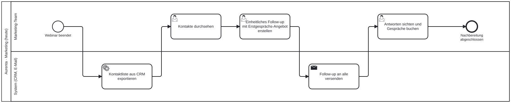
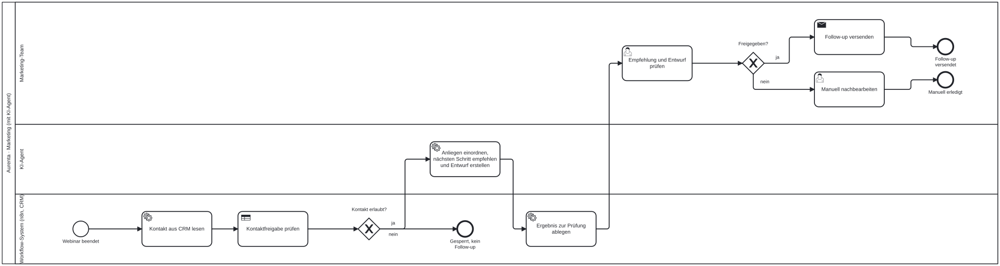

[Ein Prozessmodell zeigt, wer welchen Schritt ausführt, wo entschieden wird und wo ein Agent sinnvoll ist. Es ist die Grundlage, bevor ein Workflow in n8n oder ein Agent in Python gebaut wird.]{.lead}

## Warum zuerst modellieren

Ein Agent automatisiert einen Ablauf. Wer den Ablauf nicht kennt, baut am Problem vorbei. Das Modell macht drei Dinge sichtbar: welche Schritte feste Regeln sind und ohne Modell funktionieren, wo Sprachverständnis nötig ist und wo ein Mensch prüfen und freigeben muss. Außerdem wird aus dem Modell später die Vorlage für den Prototyp: Ein Coding-Agent wie Antigravity kann aus einem klaren Modell einen ersten Workflow erzeugen, die Gruppe prüft ihn gegen das Modell.

## Swimlane-Diagramm in BPMN 2.0

Die Notation ist BPMN 2.0, dieselbe, die Prozessmanagement-Werkzeuge wie SAP Signavio verwenden. Für die Übungen reichen Bahnen und sechs Symbole.

| Element | Bedeutung |
|---|---|
| Waagerechte Bahn (Lane) | Wer den Schritt ausführt, etwa Mitarbeitende, KI-Agent, Workflow-System |
| Rechteck mit Person | Ein Mensch entscheidet oder arbeitet |
| Rechteck mit Tabelle | Feste Regel ohne KI, etwa die Pflichtausstattung laut Car Policy |
| Rechteck mit Zahnrädern | Modellschritt oder Systemaufruf, etwa ein Vorschlag des Agenten oder das Einlesen einer Preisliste |
| Raute mit X | Entscheidung; die Pfeile tragen die Antworten (ja, nein) |
| Dünner Kreis, dicker Kreis | Start und Ende |

**Lesen:** von links nach rechts entlang der Pfeile. Jeder Schritt liegt in genau einer Bahn. Ein Modellschritt liegt in der Bahn „KI-Agent“, eine feste Regel im „Workflow-System“, die Freigabe bleibt beim Menschen.

## Beispiel: Ablauf heute und mit Agent

Das Beispiel stammt aus einem anderen Projekt: Eine fiktive KI-Beratung fasst nach einem Webinar bei ihren Kontakten nach. Es zeigt die Form, nicht den Inhalt für Mercedes-Benz.

**Heute:** Das Marketing-Team erledigt alle Schritte von Hand.

{fig-alt="Swimlane-Diagramm des heutigen Ablaufs: alle Schritte der Webinar-Nachbereitung liegen in der Bahn Marketing-Team."}

**Mit Agent:** Feste Regeln wie die Kontaktsperre prüft das Workflow-System vor dem Modellschritt, der KI-Agent erstellt einen Entwurf, Freigabe und Versand bleiben beim Team.

{fig-alt="Swimlane-Diagramm mit drei Bahnen Marketing-Team, KI-Agent und Workflow-System; die Kontaktsperre liegt vor dem KI-Schritt, Freigabe und Versand beim Team."}

BPMN-Dateien zum Öffnen und Verändern: [heute](../material/prozess/aurenta-webinar-ist.bpmn), [mit Agent](../material/prozess/aurenta-webinar-soll.bpmn). Ausführliche [Lesehilfe als Google Doc](https://docs.google.com/document/d/1pO28YSUSkvbrn8drNZqMMVqimBHT2fiyT0LEfXeF_tY/edit).

## Übertragen auf den Preislisten-Agenten

Beim Use Case von Mercedes-Benz helfen vier Fragen:

- **Feste Regel oder Modellschritt?** Pflichtausstattungen und Abhängigkeiten zwischen Codes stehen in den Unterlagen. Sie lassen sich als Regel prüfen und sollten nicht vom Modell erraten werden.
- **Wo braucht es Sprachverständnis?** Eine frei formulierte Anfrage verstehen, passende Ausstattungen vorschlagen, das Ergebnis verständlich erklären.
- **Woher stammt jede Aussage?** Jeder Vorschlag verweist auf die Fundstelle in Preisliste oder Car Policy.
- **Wer prüft?** Der Agent schlägt vor, Mitarbeitende entscheiden.

Das Einlesen neuer oder aktualisierter Preislisten ist ein eigener Ablauf und bekommt ein eigenes kleines Modell.

## Werkzeuge

- [draw.io](https://app.diagrams.net/): kostenlos im Browser, Formenbibliothek „BPMN 2.0“ über „Weitere Formen“ aktivieren, speichert in Google Drive oder lokal
- [demo.bpmn.io](https://demo.bpmn.io/): öffnet und bearbeitet `.bpmn`-Dateien direkt im Browser

Für die Teamablage die bearbeitbare Datei und einen Export als PNG oder SVG speichern, zum Beispiel im Ordner `02_Workflows/` des Team-Repositories.
